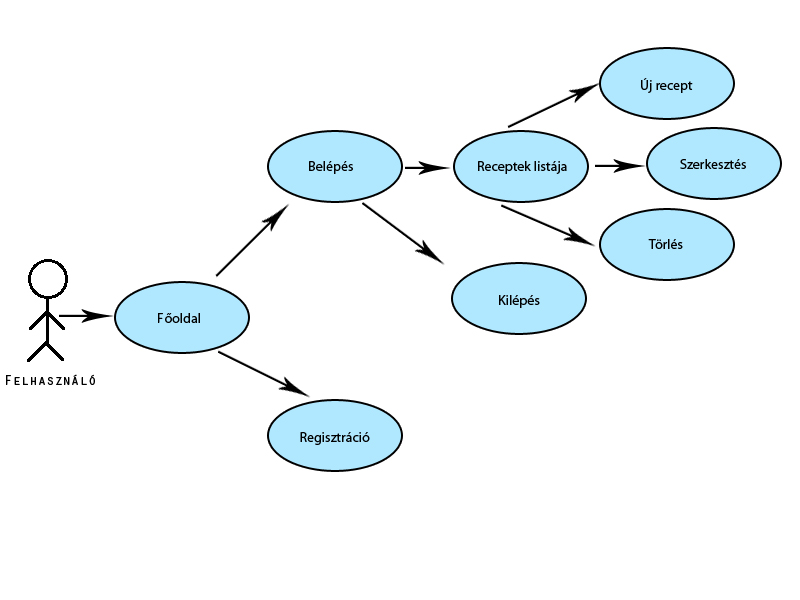
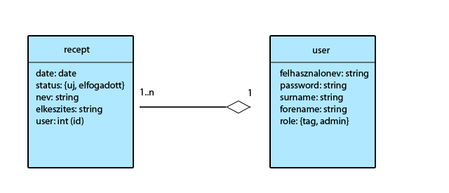
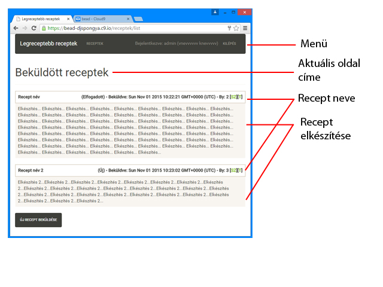

# Alkalmazások fejlesztése
1. beadandó (Receptek) - Bacsa Roland - AE8YTH

### Heroku
[alkfejlll.herokuapp.com](https://alkfejlll.herokuapp.com/)

## Követelmény feltárás
- legalább két modellt, egy-sok kapcsolatban
- legalább 1 űrlapot
- legalább 1 listázó oldalt
- legyen lehetőség új felvételére
- legyen lehetőség meglévő szerkesztésére
- legyen lehetőség meglévő törlésére
- legyenek benne csak hitelesítés után elérhető funkciók
- perzisztálás fájlba történjen

### Használatieset-modell

#### Használatieset szöveges leírása
- A felhasználó a weboldalt megnyitva az alkalmazás "Főoldal"-án találja magát. Ennek az oldalnak lényegében nincs különösebb funckiója, csak a weboldal rövid leírását tartalmazza. Innen lehetősége van belépni (amennyiben már előtte regisztrált), illetve regisztrálni. Ezeket a lehetőségeket az oldal tetején, a menüben találja meg.
- Belépést követően a felhasználó hozzáfér az oldal lényegi tartalmához. Belépve egyből láthatja a feltöltött receptek listáját. Itt van lehetősége ezeket szerkeszteni, illetve törölni.
- Új recept feltöltését követően a "státusza" először "Új" lesz, de szerkesztéssel lehetőségünk van "Elfogadott"-ra váltani.
- Kilépni szintén a menüből van lehetőségünk a "Kilépés" hivatkozásra kattintva.

### Nem funkcionális követelmények
_Fejlesztési módszertan:_
- Egységesített eljárás

_A fejlesztéshez szükséges hardver:_
- CPU: Pentium 4
- RAM: 1 GB
- Video: 1024x768

_A fejlesztéshez használt szoftverek:_
- Operációs rendszer: Windows 8.1
- Követelmény elemzés és fejlesztőeszköz: c9.io

_A futtatáshoz szükséges szoftverek:_
- Tetszőleges operációs rendszer
- Javascript futtatására alkalmas böngésző

_A futtatáshoz szükséges hardver:_
- Minimum ajánlott:
 - CPU: Pentium 4
 - RAM: 1 GB
 - Video: 1024x768

_Egyéb követelmények:_
- Interaktív felhasználói felület, ergonomikus felépítés, könnyen kezelhetőség

## Tervezés
### Adatbázis terv

### Oldal felépítése

## Implementáció
### Fejlesztőeszközök
- c9.io
- NodeJS

#### Felhasznált csomagok
- bcryptjs 2.3.0
- body-parser 1.14.1
- connect-flash 0.1.1
- express 4.13.3
- express-session 1.11.3
- express-validator 2.17.1
- hbs 3.1.1
- passport 0.3.0
- passport-local 1.0.0
- sails-disk 0.10.8
- sails-memory 0.10.5
- waterline 0.10.26
- chai 3.3.0
- mocha 2.3.3
- zombie 4.1.0

### Fejlesztői utasítások
- NodeJS szükséges a futtatáshoz!
- `npm install CSOMAGNEVE` parancs segítségével telepíthetőek a csomagok!
- Szerver indítása: `node server.js`

## Tesztelés
Tesztfájlok:
- test.js
- models/user.test.js
